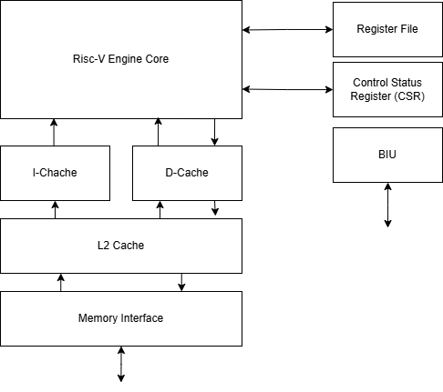

# RISC-V Processor Micro-architecture

## Components

Risc-V processor has 32 register 32 bits wide. It can read and write to these registers in 1 clk. They are use to store temporary values while performing a calculation. When a calculation is completed the results are written back (stored) in memory).

* Risc-V Engine core: it is the heart od RISC-V computer. It is the central unit that executes all the instructions. 
* I-Cache: It contains instruction cache and I-cache controller. All the command execution code come to the central processing engine through this block.
* D-Cache: It contains the data cache and D-cache controller. All the data values come to the central processing engine through this block.
* L2 Cache: It is called level 2 cache and contains instructions data and L2 cache controller logic.
* Memory Interface: it has a memory controller and talks to the RAM memory chips.
* BIU: Bus Interface Unit such as AXI that talks to peripherals (storage, keyboards, display...)

## Pipeline Stages

At the RISC-V instruction set there are sufficient instructions to carry out basic functionality. The basic RISC-V has a five pipelined stages. In a pipelined architecture each stage performs certain tasks and passes intermediate results to the next stage.

**Stage 1: Instruction Fetch (IF)**

It means instruction read. When program starts, the staring address of the execution is automatically loaded into the Program Counter (PC). The processor that fetches the instruction from the memory based on the address of the PC.
Since the memory is located far from the processor, it takes many clock cycles to fetch an instruction, but ideally the idea is to read one instruction every clock cycle. In a tipical processor, another local memory called the instruction cache (Icache) is present,
which is much smaller in size but faster. 

**Stage 2: Instruction Decode (ID)**

Its aim is to process the instruction. Each instruction has a field called the opcode. The opcode is decoded to find out what kind of operationneeds to be performed and then stored in a register. Also, in this stage, is performed the read register operation if needed,
and stores that value in a register to be used in the execution. Also if the instruction needs to read or update the CSR is done at this stage. 

**Stage 3: Instruction Execute (IE)**

The actual exectuion of the instruction happens. Such as adding two values, doing logical operations... For memory instructions (load or store) the memory address is computed in this stage. 

**Stage 4: Memory Access (MA)**

Depending on the instruction opcode, it may need to read from a memory location or write data into a memory location. Not all instructions have this stage. 

**Stage 5: Register Write Back (WB)**

This is the final stage, it writes back the final value to one of the 32 registers or the CSR registers. Not all instructions have this stage. 

## Control Hazards vs Data Hazards

When the pipeline operation is moving smoothly, the engine is able to fetch one instruction each clock cycle and the values it needs in each stage is available. That is the ideal situation. Howerver, depending on the instructions, 
there could be interruptions to this smooth flow. These are called hazards, and there are two types: control hazards and data hazards.

* Data hazards: they occur when an instruction needs data that isn't yet available, it happens when an instruction tries to access data of a previous instruction that hasn't been written yet. It can be solved by restructuring computations or using out-of-order
execution. Data hazards can cause stalls in the pipeline, which increases latency.
* Control hazards: they occur when the decision about which instruction to fetch is delayed. It is caused by branches and jumps and can be solved by predicting the correct instruction to fetch or removing branches. Control hazards can cause the entire pipeline
to be flushed and restarted, which wastes cycles.
