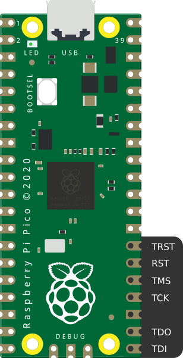
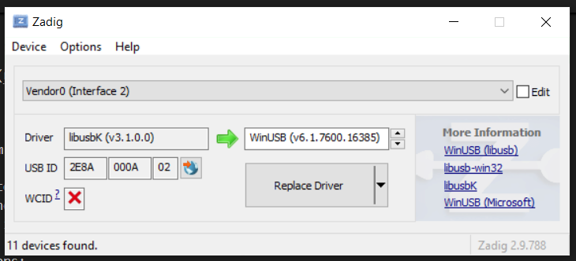
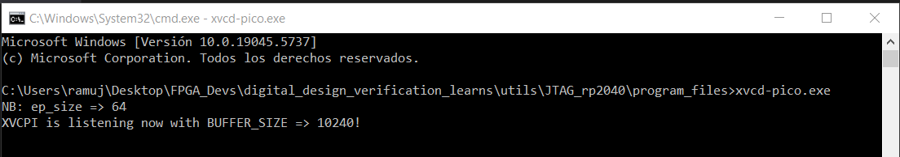
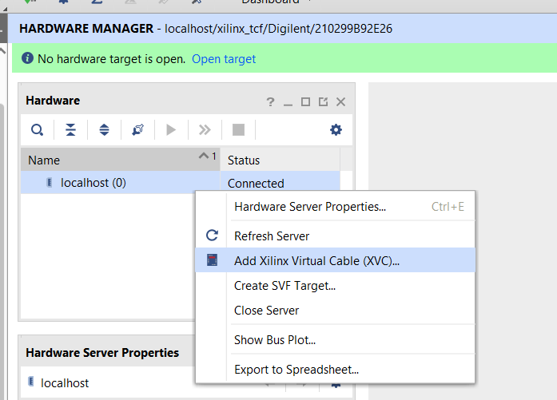
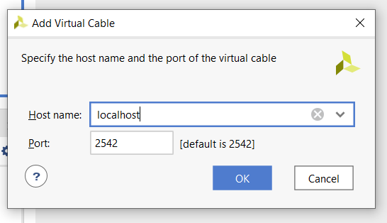

# Using a Rasberry Pico as a JTAG

A cheap and open source method to program and FPGA is using a Rasberry Pico as a JTAG cable. In order to do it you will find the instructions based on the Github open-source project [pico-xvc repository](https://github.com/kholia/xvc-pico). In folder *program_files* exists the necessary files to perform a Xilinx FPGA load using a Windows Computer. 

## Conexions: 

The pinout is as follows:

## Steps:

1. Load the program into the la Rasberry Pi (RP2040):

* Pressing the buttons BOOT and RST insert the USB cable into the computer
* When releasing the buttons, a new window would appear in the files explorer
* Put the uf2 file into that folder

2. Change the drivers:

* Install Zading in the host computer (https://zadig.akeo.ie/)
* Using Zadig install *libusbK* to the new device. You can disconnect and connect it again in order to know which is it.

3. Execute the xvc-pico.exe from command window.

4. From Vivado Hardware Manager, add the Virtual Cable with the host IP.

5. Now it act as a normal JTAG adapter. Every time you want to use it, it is necessary to only do steps 3 and 4. 