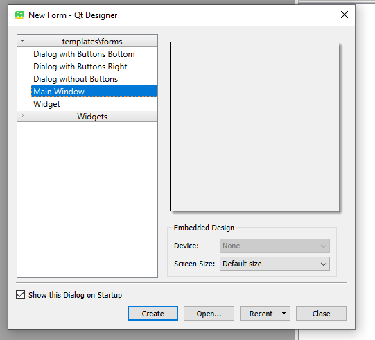
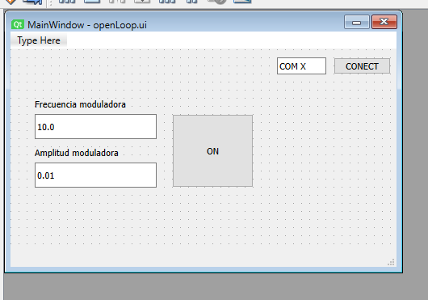
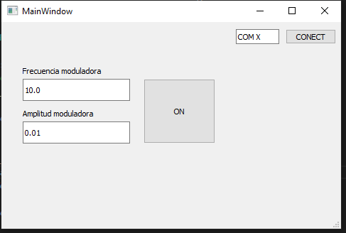

# How to create a simple GUI using QT Designer? 

1. Installation:
* Qt Designer using the following link: https://build-system.fman.io/qt-designer-download 
* In python by using pip install: PyQt5
* In python by using pip install: pyqt5-tools


2. Open Qt Designer and create a *New Form* of type *Main Window*:



2. From the lateral menu add the components that you like. Here, there is an example of a simple gui that uses: 
  * Push button: to make the UI responsive to the user
  * Labels: to show information that update periodically
  * Line edit: to get uset text inputs



3. Save the .ui file by clicking the Save Button.
4. Convert the .ui file to .py file in order to use it in python. Execute:

```bash
py -m PyQt5.uic.pyuic -x openLoop.ui -o openLoop.py
```

5. Create a gui.py file. This would be the ''backend'' of the console. The first thing to do in the script is to add the generated python file to it. 

```python
import sys
from openLoop import Ui_MainWindow
from PyQt5.QtWidgets import QApplication, QMainWindow
```

6. In order to create and run the window the following code is needed. When executing the script the created window should appear as in the image.  

```python
class MiVentana(QMainWindow):
    
    def __init__(self):
        # Crear ventana y aplicacion
        super().__init__()
        self.ui = Ui_MainWindow()
        self.ui.setupUi(self)


if __name__ ==  "__main__":
    app = QApplication(sys.argv)
    ventana = MiVentana()
    ventana.show()
    sys.exit(app.exec())
```



7. Create push button callback:

```python
  def onButton_callback(self):
      
    print("onButton Callback")
```

8. Link callback to button and when executing the script *gui.py* in the terminal will appear: "onButton Callback".

```python
  self.ui.onButton.clicked.connect(self.onButton_callback)
```

You can repeat the same process will all the Push Buttons that you like. In order to get the name of each component you need to identify each element in the .ui file. This can be done beacuse each element is contained in a widget where it is easy to indentify the name, the size, the position or the displayed text.

```html
<widget class="QWidget" name="centralwidget">
  <widget class="QPushButton" name="onButton">
  <property name="geometry">
    <rect>
    <x>200</x>
    <y>80</y>
  <width>101</width>
  <height>91</height>
  </rect>
</property>
<property name="text">
  <string>ON</string>
</property>
</widget>
```

9. In order to get the values introduced by the user in the QLineEdit call the text method. Take into account it returns a string so it needs to be casted if a number is expected.

```python
  amp_mod_value = float(self.ui.amp_mod.text())
```

10. In order to write in a QLabel use the setText method.

```python
  self.ui.conection_label.setText("Connected")
```

When every element on the interface has been handled, it is the time to make the ui interact with an element, by adding a communication interface. In this example UART is used.  

You should create a class for the communication protocol, and at least manage the connexion, the sending and the receiving functions. In this example the packet creation and decoding is also managed at the UART class. 

