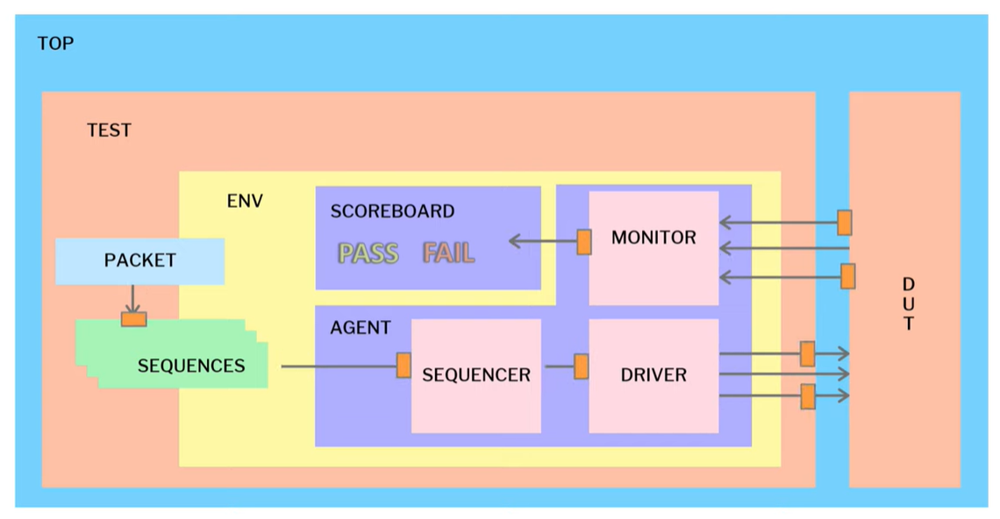

# UVM

UVM is a framework of SystemVerilog classes from which fully functional testbenches can be built. The methodology specifies and lays out a set of guidlines to be followed for creation od verification testbenches. UVM provides a set of base classes from which more complex classes can be build by inheritance and adding into it certain functions required for verification enviroment.

Advantages:
* Ensure uniformity between different verification teams.
* Flexibility.
* Ease of mantaining testbenches.

*Example:* The sequence-driver hanshake mechanishm is taken care of under the hood so that only stimulus need to be written. This saves quite a lot of time in setting up a testbench stucture since the foundation itself is well defined.

📂 [Example: Pattern detection](examples/test_plan.md) 

## Components vs Objects

Every simulation testbench has a few key components like: drivers, monitors, stimulus generators and scoreboards. UVM provides a base-class for each component, with standarize functions to instantiate, connect and build the testbench enviroment. These are static entities called components, that exist throughout a simumlation. These components operate and process on some kind of data that flows around the environment. The data or transactions are called objects or sequence items the appear and disappear at varios times in the simulation and is more dynamic in nature. 

*uvm_object* is the main class, it defines methods for common operations like copy, compare and print. Typically it is used to build testbench and testcase configurations. 

There are two branches in hierarchy:
* *uvm_component*: classes that define verification components: *uvm_driver, uvm_monitor, uvm_sequencer_ uvm_agent, uvm_test, uvm_env, uvm_scoreboard*.
* *uvm_transaction*: classes that define data objects consumed and operated upong by verification components: *uvm_sequence_item, uvm_sequence_base, uvm_sequence*.

**Objects**

* *uvm_sequence* is a container for the actual stimulus to the design. If you put different stimuyli into differents sequences, it enhances the ability to reuse and drive thsese sequences in random order to get more coverage and verifiacation results. 
* *uvm_sequence_item* is a data object that have to be driven to DUT are generally called as sequence items.

**Components**

* *uvm_driver*: drive signals to DUT
* *uvm_monitor*: monitor signals at DUT output port
* *uvm_sequencer*: create different tests patterns
* *uvm_agent*: contains the sequencer, driver and monitor
* *uvm_env*: contains all other verification components
* *uvm_scoreboard*: checker that determines if test passed/failed
* *uvm_subscriber*: subscribes to activites of other components

## Phases

A main feature that components inherit from their parents class *uvm_component* is Phasing. Each component hoes thorugh a pre-defined set of phases, and it cannot proceed to the neext phase until all components finish their execution in the current phase. So UVM phases act as a synchronizyng mechanism in the life cycle of a simulation. 

Methods that do not consume simulation time are functions and methods that consume simulation time are tasks. 

1. Build time phases:
    * *build_phase* (function): used to buiild testbench compoents and create their instances.
    * *connect_phase* (function): used to connect between different testbench components.
    * *end_of_elaboration_phase* (function): other functions requerid to be done after conection.
    * start_of_simulation_phase (function): used to set initial run-time configuration or display
2. Run time phases: 
    * *run_phase* (task): actual simulation that consumes time, runs parallel to other UVM run-time phases.
3. Clean-up phases:
    * *extract_phase* (function): used to extract and compute expected data from scoreboard.
    * *check_phases* (function): used to perform scoreboard tasks that check for errors between expected an actual values. 
    * *report_phase* (function):  used to display results from checkers, summary, and other test objectives
    * *final_phase* (function): typically used to do last minute operations before exiting simulation.

**Why SystemVerilog testbench need phases and verilog testbench does not?**

Verilog testbenches have all its components made of static containers or modules. Since a module is static, all modules will be created at beginning of the simulation and don't have to worry about any components getting called without being created or initialized. SystemVerilog introduces OOP features. This enables the creation of well structured entites that can be rused and desployed when required. These class objects can be created in the middle of the simulation. What means is that testbench components can be created at different times, and hance you could end up calling a copmponent while it hasn't been initialized yet leading to woring testbench outputs.  
