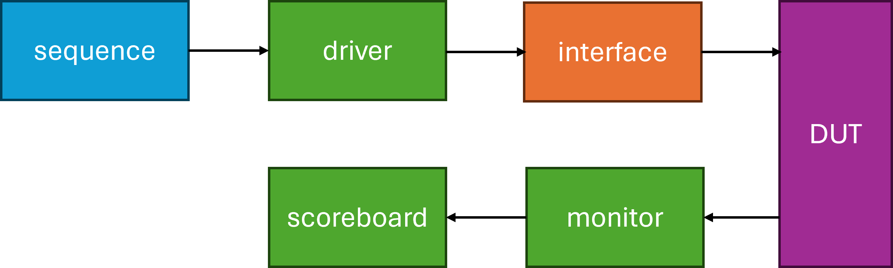

# Verification Testbench Example

## Especification

The design is a pattern detector written in Verilog to identify a pattern in a stream of input values. On every clock there is a new input to the design and when it matches the pattern '1011', the output is set to 1. The implemented design is *detect_pattern* module. It consists on a shift register and a comparator. 

## Testbench

* The sequence generate random stream input values that will be passed to the driver as a sequence item. 
* The driver receives the item and drives it to the DUT through a virtual interface. 
* The monitor captures values on the DUT's input and output, creates a packet and sends to the scoreboard.
* The scoreboard checks the functional correctness based on the values received from monitor. 



### Sequence Item

```verilog
// This is the base transaction object. It will be used in the enviroment to 
// initiate new transactions and capture transactions at DUT interface.

class Ittem extends uvm_sequence_item; // extends the UVM provided class uv_sequence_item

`uvm_object_utils(Item) // register object with a factory

rand bit in; // Name of input port that shoud be randomize
bit out; // Name of output port that shoud be captured

// typical function used to convert attributes to string
virtual function string convert2str();
    return $sformatf("in=%0d, out=%0d", in, out);
endfunction

function new (string name = "Item") // Constructor
    super.new(name);
endfunction

// constain block: expression used to limit the 
// values of random variables 
constraint c1 { in dist {0:/20, 1:/80}; } 
// in debe valor 0 con una probablidad del 20% 
// y 1 con una probablidad del 80%

endclass
```

### Sequence 

```verilog
class gen_item_seq extends uvm_sequence;

`uvm_object_utils(gen_item_seq) // register object with a factory

function new(string name="gen_item_seq") // constructor
    super.new(name);
endfunction

rand int rum; // config total number of items to be sent

//num is prefered in range 10-50 but it can be modified by external configurations
constraint c1 { soft num inside {[10:50]};} 

virtual task body(); // begin point of sequence
    for (int i = 0; i < num; i ++) begin // generates num items
        // creates a new sequence item called m_item of kind Item
        Item m_item = Item::type_id::create("m_item"); 
        // start transaction
        start_item(m_item);
        // randomize value of rand variables applying restrictions
        m_item.randomize();
        // prints info
        `uvm_info("SEQ", $sformatf("Generate new item: %s", m_item.convert2str()), UVM_HIGH)
        // finish transaction
        finish_item(m_item);
    end
    `uvm_info("SEQ", $sformatf("Done generation of %0d items", num), UVM_LOW)
endtask
endclass
```

### Driver

```verilog
// The driver is responsible for driving transactions to the DUT
class driver extends uvm_driver #(Item);

`uvm_component_utils(driver)

function new(string name = "driver", uvm_component parent=null); //constructor
    super.new(name, parent);
endfunction

virtual des_if vif; // creates virtual interface type of des_if

virtual function void build_phase(uvm_phase phase); // build phase function
    super.build_phase(phase);
    if (!uvm_config_db#(virtual des_if)::get(this, "", "des_vif", vif)) // gets virtual inteface from configuration data base of UVM
        `uvm_fatal("DRV", "Could not get vif")
endfunction

virtual task run_phase(uvm_phase phase);
    super.run_phase(phase)
    forever begin
        Item m_item; // declares a transaction type of Item (parameter)
        `uvm_info("DRV", $sformatf("Wait for item from sequencer"), UVM_HIGH)
        seq_item_port.get_next_item(m_item);
        drive_item(m_item); // convert item into DUT signals
        seq_item_port.item_done();
    end
endtask

virtual task drive_item(Item m_item); // convert item into DUT signals
    @(vif.cb);
    vif.cb.in <= m_item.in;
endtask

endclass
```

### Monitor

```verilog
// The monitor has a virtual interface handle with wihic it 
// can monitor the events happening on the interface

class monitor extends uvm_monitor;

`uvm_component_utils(monitor)

function new(string name="monitor", uvm_component parent=null);
    super.new(name, parent);
endfunction

uvm_analysis_port  #(Item) mon_analysis_port; // port to monitor

virtual des_if vif; // creates virtual interface type of des_if

virtual function void build_phase(uvm_phase phase);
    super.build_phase(phase);
    if (!uvm_config_db#(virtual des_if)::get(this, "", "des_vif", vif)) // gets virtual inteface from configuration data base of UVM
      `uvm_fatal("MON", "Could not get vif")
    mon_analysis_port = new ("mon_analysis_port", this);
  endfunction

virtual task run_phase(uvm_phase phase);
    super.run_phase(phase);
    // This task monitors the interface for a complete
    // transaction and writes into analysis port when complete
    forever begin
      @ (vif.cb);
			if (vif.rstn) begin
				Item item = Item::type_id::create("item");
				item.in = vif.in;
				item.out = vif.cb.out;
				mon_analysis_port.write(item);
              `uvm_info("MON", $sformatf("Saw item %s", item.convert2str()), UVM_HIGH)
			end
    end
  endtask

endclass
```

### Scoreboard

```verilog
// The scoreboard is responsible to check design functionality.

class scoreboard extends uvm_scoreboard;

`uvm_component_utils(scoreboard)

function new(string name="scoreboard", uvm_component parent=null);
super.new(name, parent);
endfunction

bit[`LENGTH-1:0] 	ref_pattern;
bit[`LENGTH-1:0] 	act_pattern;
bit 				exp_out;

uvm_analysis_imp #(Item, scoreboard) m_analysis_imp; // declare analysis port, first parameter is expected data type and second is where is handled

virtual function void build_phase(uvm_phase phase);
    super.build_phase(phase);

    m_analysis_imp = new("m_analysis_imp", this); // creates analysis port
    if (!uvm_config_db#(bit[`LENGTH-1:0])::get(this, "*", "ref_pattern", ref_pattern)) // obtains ref pattern 
            `uvm_fatal("SCBD", "Did not get ref_pattern !")
endfunction

virtual function write(Item item); // Process received data
    act_pattern = act_pattern << 1 | item.in;

    `uvm_info("SCBD", $sformatf("in=%0d out=%0d ref=0b%0b act=0b%0b",
                               item.in, item.out, ref_pattern, act_pattern), UVM_LOW)

    // Always check that expected out value is the actual observed value
    // Since it takes 1 clock for out to be updated after pattern match,
    // do the check first and then update exp_out value
    if (item.out != exp_out) begin
      `uvm_error("SCBD", $sformatf("ERROR ! out=%0d exp=%0d",
                                   				item.out, exp_out))
    end else begin
      `uvm_info("SCBD", $sformatf("PASS ! out=%0d exp=%0d",
                                  item.out, exp_out), UVM_HIGH)
    end

    // If current index has reached the full pattern, then set exp_out to be 1
    // which will be checked in the next clock. If pattern is not complete, keep
    // exp_out to zero
    if (!(ref_pattern ^ act_pattern)) begin
      `uvm_info("SCBD", $sformatf("Pattern found to match, next out should be 1"), UVM_LOW)
		exp_out = 1;
    end else begin
      exp_out = 0;
    end

  endfunction

endclass

```

### Agent 

```verilog
// Create an intermediate container called "agent" to hold
// driver, monitor and sequencer
class agent extends uvm_agent;
  
`uvm_component_utils(agent)

function new(string name="agent", uvm_component parent=null);
super.new(name, parent);
endfunction

driver 		    d0; 		// Driver handle
monitor 		m0; 		// Monitor handle
uvm_sequencer #(Item)	s0; 		// Sequencer Handle

virtual function void build_phase(uvm_phase phase); // builds driver monitor and sequencer
    super.build_phase(phase);
    s0 = uvm_sequencer#(Item)::type_id::create("s0", this);
    d0 = driver::type_id::create("d0", this);
    m0 = monitor::type_id::create("m0", this);
endfunction

virtual function void connect_phase(uvm_phase phase); // connect sequencer with driver
    super.connect_phase(phase);
    d0.seq_item_port.connect(s0.seq_item_export);
endfunction

endclass

```

### Enviroment

```verilog

// The environment is a container object simply to hold
// all verification  components together. This environment can
// then be reused later and all components in it would be
// automatically connected and available for use
class env extends uvm_env;

  `uvm_component_utils(env)

  function new(string name="env", uvm_component parent=null);
    super.new(name, parent);
  endfunction

  agent 		a0; 		// Agent handle
  scoreboard	sb0; 		// Scoreboard handle

  virtual function void build_phase(uvm_phase phase);
    super.build_phase(phase);
    a0 = agent::type_id::create("a0", this);
    sb0 = scoreboard::type_id::create("sb0", this);
  endfunction

  virtual function void connect_phase(uvm_phase phase);
    super.connect_phase(phase);
    a0.m0.mon_analysis_port.connect(sb0.m_analysis_imp);
  endfunction

endclass

```

### Test

The base test class configures the enviroment, obtains the virtual interface and configures the reference patterns. It also applies reset, inits sequence and manage simulation end. While test_1011 extends the base test class in order to specialize it to match pattern 1011. It is easier to afterwards create new patterns. 

```verilog

class base_test extends uvm_test;

`uvm_component_utils(base_test)

env  e0;  // Instantiate verification enviroment
bit[`LENGTH-1:0] pattern = 4'b1011;  // Reference Pattern
gen_item_seq seq;  // Instatiate sequence
virtual des_if vif;  // Virtual interface to connect DUT

virtual function void build_phase(uvm_phase phase);
  super.build_phase(phase);

  // Create environment
  e0 = env::type_id::create("e0", this);

  // Obtain virtual interface from uvm_config_db
  if (!uvm_config_db#(virtual des_if)::get(this, "", "des_vif", vif))
    `uvm_fatal("TEST", "Did not get vif")
  
  // Set interface into the agent inside the enviroment
  uvm_config_db#(virtual des_if)::set(this, "e0.a0.*", "des_vif", vif);

  // Configure reference pattern
  uvm_config_db#(bit[`LENGTH-1:0])::set(this, "*", "ref_pattern", pattern);

  // Create sequence and randomize
  seq = gen_item_seq::type_id::create("seq");
  seq.randomize();
endfunction

virtual task run_phase(uvm_phase phase);
  phase.raise_objection(this); // We raise objection to keep the test from completing
  apply_reset(); 
  seq.start(e0.a0.s0);  // Start sequencer from agent
  #200;
  phase.drop_objection(this);  // We drop objection to allow the test to complete
endtask

virtual task apply_reset();
    vif.rstn <= 0;
    vif.in <= 0;
    repeat(5) @ (posedge vif.clk);
    vif.rstn <= 1;
    repeat(10) @ (posedge vif.clk);
  endtask

endclass
```

```verilog

class test_1011 extends base_test;
  `uvm_component_utils(test_1011)
  function new(string name="test_1011", uvm_component parent=null);
    super.new(name, parent);
  endfunction

  virtual function void build_phase(uvm_phase phase);
    pattern = 4'b1011;
    super.build_phase(phase);
    seq.randomize() with { num inside {[300:500]}; };
  endfunction
endclass

```

### Interface

```verilog

// The interface allows verification components to access DUT signals
// using a virtual interface handle
interface des_if (input bit clk);
  	
    logic rstn;
	logic in;
	logic out;

	clocking cb @(posedge clk);
      default input #1step output #3ns;
		input out;
		output in;
	endclocking

endinterface
```

### Testbench top

```verilog

module tb;
  
  bit clk;

  always #10 clk =~ clk; // Generate clock

  des_if _if (clk); // instantiate interface

	detect_pattern u0 	( .clk(clk),
                     .rstn(_if.rstn),
                     .i_data(_if.in),
                     .or_dout(_if.out));


  initial begin
    clk <= 0;
    uvm_config_db#(virtual des_if)::set(null, "uvm_test_top", "des_vif", _if);
    run_test("test_1011");
  end

endmodule

```